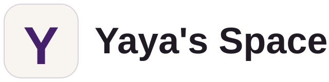

<p align="center">
  <picture>
    <source media="(prefers-color-scheme: dark)" srcset="docs/assets/readme/logo-dark.svg">
    
  </picture>
</p>

<p align="center">
  A sealed, local-first macOS menu-bar toolkit.<br>
  A personal fork of <a href="https://github.com/vorssaint/vorssaint-utils">Vorssaint</a> by Pedro Gomes, GPL-3.0-or-later.
</p>

<p align="center">
  <a href="#install">Install</a> ·
  <a href="#everything-it-does">Features</a> ·
  <a href="#network-policy">Network policy</a> ·
  <a href="#what-changed-from-upstream">What changed</a> ·
  <a href="#build-it-yourself">Build</a> ·
  <a href="CHANGELOG.md">Changelog</a>
</p>

<p align="center">
  <a href="LICENSE"></a>
  
  
</p>

## What Yaya's Space is

Yaya's Space is Yahya Elghobashy's build of the Vorssaint menu-bar utility: one icon holding a volume mixer, a system monitor, window and Dock controls, keyboard and mouse tweaks, clipboard tools, screen capture, keep-awake and more. It is the upstream 3.3.5 code base, sealed so that every outbound request is a read-only HTTPS GET to a short list of hosts, then rebranded under its own name, icon, bundle id and update feed as the upstream [trademark policy](https://github.com/vorssaint/vorssaint-utils/blob/main/TRADEMARKS.md) asks of forks.

It is built and used by one person, on one Mac, from source. There is no App Store listing, no Homebrew cask, no notarized download and no auto-install.

Not affiliated with or endorsed by Vorssaint.

## Network policy

Every request the app can make passes through one wrapper, `SealedURLSession` (`Sources/YayasSpace/Sealed/NetworkPolicy.swift`), which refuses anything that is not a body-less HTTPS GET to one of these hosts:

| Host | Used for |
| --- | --- |
| `api.github.com` | Update check for this repository's releases, and the read-only "upstream inspiration" check of Vorssaint's latest release. A notice is shown; nothing is downloaded. |
| `itunes.apple.com` | App Updates: App Store lookup by bundle id. |
| `uclient-api.itunes.apple.com` | App Updates: App Store lookup by store id. |
| `formulae.brew.sh` | App Updates: the public Homebrew cask catalog (`/api/cask.json` only). |

One deliberate per-click exception: the radial menu's "Fetch Website Icon" button asks for `/favicon.ico` on exactly the host you typed, for that click only (GET, 5 s, 2 MB cap, same-origin redirects).

Beyond that: no telemetry, no crash reports, no analytics, no uploads, no feedback endpoint, no publisher (Sparkle) feeds, no speed-test endpoint. Both update checks share one "Check for updates automatically" toggle; switch it off and the app makes no request at all. `Tools/check-sealed.sh` scans the sources for any other networking API, network-capable shell tool or remote host literal and fails the build if one appears.

Links that open in your browser on a click (the repository, the upstream project, a release page) go to `github.com` only.

## What changed from upstream

Removed at the source, not hidden:

- Screenshot and recording link uploads (the "Create link" actions). Wherever they lived, a "Share…" button now opens the macOS share sheet on the local PNG / MP4 instead; macOS does the sending.
- The Feedback entry points (Settings, panel, command bar).
- The in-app Cloudflare speed test. The row runs Apple's `/usr/bin/networkQuality` or opens Speedtest.app.
- Homebrew analytics (popularity badges) and the `curl | bash` installer button.
- Publisher update feeds and the DMG download / install path. Updates are a notice with an "Open release page" button; you rebuild from source to adopt one.
- Showcase media, the Discord / X / donation links, the upstream signing identities and release workflow.

Added:

- `SealedURLSession` and `NetworkPolicy` as the single network choke point, plus `Tools/check-sealed.sh` as the guard.
- The "upstream inspiration" notice: when Vorssaint publishes a new release, the panel and Settings show "Vorssaint upstream shipped vX.Y — see what changed" once per release, with an "Open release page" button.
- A build.sh `--dev` path that signs ad hoc, never touches the keychain and keeps a finished copy in `dist/`.

Everything else, including all twelve localisations, is the upstream feature set.

## Install only what you use

Nobody needs all of it, and Yaya's Space is built around that. The Features page installs and uninstalls whole features: what you uninstall disappears from the entire app and stops loading, so it spends no CPU, memory or energy. Nothing is deleted, and installing again brings your old settings back.

First setup offers three one click bundles, Essentials, Windows, and Battery and quiet, plus a visual picker for choosing individual features. Only the permissions those choices need are requested next, and everything can be changed later in Settings. Every feature also wears an honest energy badge saying what it keeps alive while on.

The rest bends the same way: panel sections reorder and hide, the compact layout trades sections for tabs, settings export to a file and import on a new Mac, the app can stay light or dark apart from the Mac, and the whole app speaks more than a dozen languages.

## Everything it does

### Sound

- **Volume mixer.** Adjust the Mac's overall volume or slide any single app up or down, enter an exact percentage, and push a quiet one past 100 percent when a video is just too low. Send system sounds through another output, or hide the apps you never adjust to keep the list short. No audio driver, no setup.
- **Per app output.** Send your music to the speakers and a call to your headset at the same time.
- **Output switcher.** Cycle between chosen outputs with one shortcut, and drop the volume automatically when headphones disconnect.
- **Microphone tools.** Pin your favorite input so the Mac stops guessing, and mute every microphone at once with a click or shortcut, whichever one an app is using.
- **Music app blocker.** Stops the Music app from bursting in when headphones connect. You can still open it yourself.

### Know what your Mac is doing

- **System monitor.** CPU, GPU, memory, swap use and temperatures with history graphs, including a choice between total memory in use and memory held by apps, plus battery charge, temperature, health, time remaining, cycle count and power draw together in Power, an optional Fan Control beta with continuous manual speeds, custom temperature curves and live RPM, the apps burning energy right now and a shortcut to the Mac's full process inspector.
- **Menu bar readouts.** Keep the readings you care about in the bar itself, with values or compact usage bars, including optional battery time remaining and fan speed, combined or as separate items.
- **Network.** Live rates and session totals. The speed test row runs Apple's own `networkQuality` tool or opens Speedtest.app; nothing in the app measures your line itself.
- **Alerts.** Optional notifications for sustained CPU load, high CPU or battery temperature, memory pressure, low disk space and low battery.

### Windows and the Dock

- **App switcher.** A richer take on pressing ⌘Tab, with adjustable live window thumbnails, minimized windows included, and more than one window per app. Simple mode keeps every window and its title without previews or screen capture, with optional grouping to one entry per app. Optionally press S to keep search open after releasing the switcher shortcut, or hide the shortcut hints below the large icon row. Press the window shortcut directly to move between windows of the app in front. Choose whether it opens on the screen under the pointer, the one with the menu bar or the one with the active window. Set per-app rules to include windowless apps, keep them window-only or hide them. Choose apps where Yaya's Space pauses both switcher and Dock thumbnail capture while they are in front. Minimal previews hide window titles, controls and decoration while keeping selection visible. Middle-click a preview to close that window.
- **Window layout.** Snap the active window to halves, including a centered half-width placement, thirds, sixths, corners or center with configurable gaps between windows and screen edges, maximize it with or without a margin, or move it to the next or previous display, each with its own optional shortcut. Using the left or right shortcut again carries the window to the display on that side, landing on the half it came in through. Restore steps back through recent placements. Turn on edge snapping in Window Layout, choose its active edges and corners on the visual screen map, then drag a title bar there for a live preview. Hold chosen modifiers and drag anywhere to move it, then add Shift to resize. A mouse can also resize with the right button.
- **Dock Preview.** Hover a Dock icon to see adjustable window thumbnails with clear titles, click the one you want or drag it to move and snap the window. Middle-click closes only the pointed window, including in pinned previews. Optional minimal previews hide titles, controls and decoration.
- **Dock clicks.** Click the Dock icon of the active app to minimize its windows, hide the app, or cycle through its windows.
- **Maximize windows.** The green button fills the screen without creating another Space, and puts the window back on the next click.
- **Quit on close.** Apps you choose quit when their last window closes.
- **Quit and close protection.** Protect ⌘Q and ⌘W with a hold, double press or extra modifier, independently and only for the apps you choose.

### Keyboard and mouse

- **Text snippets.** Type a short trigger anywhere and it becomes your text, expanded instantly or after a space, with clipboard variables plus date and time in any format you like. A searchable quick menu, organized into folders, types any snippet right at your cursor.
- **Smooth scrolling.** Gives a mouse wheel a fluid glide with adjustable speed and response.
- **Pointer acceleration.** Optionally disable acceleration for connected mice while preserving the previous system setting for restoration.
- **Focus follows mouse.** Install it from Features to bring the window under the
  pointer to the front after an adjustable pause. It waits while you drag or hold a
  modifier key.
- **Scroll direction.** Invert vertical and horizontal wheel movement separately without
  touching the trackpad's natural scrolling.
- **Side buttons.** The mouse Back and Forward buttons start meaning it, in Finder, browsers and compatible apps.
- **Mouse button shortcuts.** Give any extra button or side-wheel direction a key combination of your choice, or hold a button and drag to switch Spaces, open Mission Control or show the current app's windows.
- **Middle click.** A three finger press becomes a real middle click.
- **Apps to leave alone.** Every feature above can name apps from anywhere on your Mac that drive themselves with the mouse, like 3D and design tools, and it steps aside in those.
- **Extra click filter.** Ignore rapid accidental extra clicks from worn primary, secondary and middle mouse buttons without delaying normal clicks.
- **Key debounce.** Filters the double letters a worn keyboard invents.
- **Super key.** Hold Caps Lock or a right-side modifier key and it counts as the modifier combination you choose, so one key can drive your shortcuts. A tap on its own can switch input sources, switch capitals, press Escape, or do nothing. Choose apps that pause Super key while they are open, even in the background, so the selected key works normally until the last one quits. Keep the selected key at its default action in System Settings › Keyboard › Modifier Keys.
- **Keyboard shortcuts.** Edit every installed feature's global shortcut from one categorized page, see what is active and use the shorter Super key combination when available. On supported Macs, enable optional keyboard backlight shortcuts under Mouse and keyboard › Keyboard light to adjust it one step at a time.

### Clipboard, files and links

- **Clipboard history.** Local history of text, images and files with pinned favorites, search, quick paste shortcuts and an on-demand preview where text can be selected or edited.
- **Auto clear clipboard.** Empty the system clipboard a set time after you copy, and when the Mac sleeps, the display sleeps or the screen locks. Each trigger is optional, works with history off, and leaves your saved items untouched.
- **Paste as plain text.** One shortcut pastes without fonts, colors or links, and the original stays on the clipboard.
- **Shelf.** Park files, text and links near your cursor mid drag, or open it from a screen edge, then drop them where they belong later. Share the files you parked anywhere the Mac can send them. Choose whether its close button clears every item or keeps them for later.
- **Finder shortcuts.** ⌘X and ⌘V move files, an optional F2 shortcut renames the selection, and copied images can become PNG files with ⌘V.
- **Clean URL.** Strips tracking parameters and extra names you choose from copied links, on demand or automatically.
- **Disk image installer.** When a mounted disk image contains one app, install it into Applications with one click and eject the image. Choose whether to move its download to Trash and show the installed app in Finder.

### Everyday tools

- **Command Bar.** One shortcut opens a field over whatever you are doing. Drag its mark to place it anywhere on a screen, or double-click the mark to put it back. Type a few letters to run any Yaya's Space action, open an app, switch to a window, insert a snippet, paste from your clipboard history at the cursor, and it reaches into the app you are using to run any command from its menus, showing that command's own shortcut. It answers sums, conversions, dates and questions about your Mac as you type, opens a web address you enter, and acts on the text you already have selected. Saved shortcuts can also run a local script and show its output as you type. Name a few folders and it finds files in them by name too, through the Mac's own search, without building its own index or looking beyond the folders you choose. Apps also answer to alternate names known by macOS, and the Mac's own Settings panes are one row away. Manage app shortcuts from Keyboard shortcuts or Command Bar settings with a searchable app list, editable aliases, pinned favorites and shortcut recording in each row. App shortcuts also work before the bar first opens after launch. Press ⌘K on an app to quit, restart, force quit or send it to the Uninstaller, and on any row to name it, pin it, hide it or give it a shortcut of its own; ⌘Return shows an app, a folder or a file where it lives. Bug reports and feature ideas can also be sent from here, with every technical detail shown before you choose whether to include it. Start with a colon or open the Emoji category to find emoji by name and familiar English terms. It tolerates short typos and remembers search choices across launches without saving the text you type. Clear all learned choices in Settings or forget one result from its actions.
- **Quick panel.** ⌃⌘V opens a small floating palette with your favorite tools one key away.
- **Quick toggles.** One-click system actions in their own panel tab: switch light and dark mode, toggle the keyboard light, empty the Trash, eject every disk except drives you exclude in Settings, show hidden files, hide desktop icons, lock the screen and more.
- **Radial menu.** Hold a shortcut, or any extra mouse button, and a wheel of your favorite actions opens around the pointer: apps, files, links, key combos, media controls, quick toggles and Yaya's Space tools, with submenus for more. Point and release to run one. Custom profiles let you switch between different wheel layouts, color themes, shortcuts and mouse triggers, and website links can fetch their actual icons on demand.
- **Screen capture.** Screenshots, screen recordings, copying text from the screen and picking a color share one selector, and each tool's own shortcut opens it already on that tool, ready to switch. Each tool can hide the mode menu when opened through its keyboard shortcut, while capture buttons keep it visible. A pixel-grid magnifier shows the exact point and color, moves one pixel at a time with the arrow keys and copies the color without ending the capture. Its zoom can start at a chosen level or remember the last one, with fast or step-by-step wheel control and ⌥ to switch temporarily. Only installed tools appear, recording sound and microphone choices stay beside the mode selector, and every related setting lives on one page with a separate mode for each tool.
- **Screenshot.** Capture an area, a window or the whole screen on a frozen picture, or join a long page or document by scrolling it yourself, then pressing Enter or Done. It can include ordinary Yaya's Space windows without showing its own capture controls. Its quick preview can stay near the shot or in any screen corner, can be dragged out as a PNG, and can copy, save, delete or open the editor, which adds stickers, annotations, precise crop, redaction, adjustable backgrounds and pinned captures. Recent screenshots and recordings stay one click away in their panel cards and editors, and are searchable from the Command Bar. Copied captures paste as PNG files, including in tools that expect a file path. The preview and editor can share a capture for 1, 6 or 24 hours and delete it early from the app. A QR code in the shot shows its content to copy or open, from the preview and the editor. Optional timer, save folder and 1x export included. Captures can copy themselves to the clipboard, run your favorite action right after the shot, save into dated subfolders with a file name pattern of your own, and use separate shortcuts for a whole-screen shot, the latest capture or any copied image.
- **Screen recording.** Record an area, a window or the whole screen with optional system sound and microphone audio on separate tracks. A dimmed guide keeps the chosen area visible while recording, and floating controls can pause, resume or stop it. Choose either source while selecting, then adjust its volume or remove it in the editor. Yaya's Space windows can be selected like any other while recording controls stay out. The editor trims, cuts, smooths the pointer, adds optional automatic zooms that can stay with typing after a click, adds text and pictures with adjustable size, position and transparency, blurs any area for as long as you choose so private details stay hidden even inside zooms, adds adjustable backgrounds, and saves reusable presets. Copy the finished video directly, copy and delete in one step, export video and GIF files to the folder you choose, or compress it locally and share a temporary 1-hour or 6-hour link under 100 MB.
- **Camera preview.** A floating mirror to check how you look before joining a call, one click or shortcut away. Pick the camera when several are connected; it closes as soon as you click away.
- **Scratchpad.** Floating pads in named tabs for short-lived text: meeting notes, numbers, fragments on their way somewhere else. They save as you type, preview Markdown formatting on demand, step aside when you click elsewhere (or stay floating, your call), and can copy everything, export to a file or clear themselves after a quiet period.
- **Copy text from screen.** Select any area and its text is recognized offline, straight onto the clipboard, optionally joining line breaks into one paragraph. When the area holds a QR code, its content is shown so you can copy it or open the link.
- **Color picker.** Grab any pixel from the shared screen selector as HEX, RGB, HSL or SwiftUI code, with the system loupe kept as a permission-free fallback.
- **App updates.** One list of the apps on your Mac that have a newer version. In this build it checks package-managed apps, the App Store and the public Homebrew cask catalog; publisher update feeds are not queried. Managed updates install together; other rows open the original app so its own updater stays in control. Each source can be switched off, and optional background checks tell you when something is waiting.
- **Cleaner.** Sweeps app leftovers, caches and logs, by hand or on a schedule.
- **Messaging downloads.** The Cleaner can also tidy the media a messaging app saves into Downloads, confirmed by macOS metadata and only ever moved to the Trash, with a review list, retention rules and an optional organizer that files new ones into a folder of your choice.
- **Uninstaller.** Drop an app in and take its caches, preferences, helpers, plugins, containers and other leftovers to the Trash with it. Related finds start unchecked so you can review them first.
- **Media tools.** Compress videos or open any one in the editor to trim, cut and crop it, convert images one at a time or in batches with resizing, watermarks and reusable profiles, make GIFs and extract text, all locally.
- **Homebrew manager.** Search, install and remove formulae and casks without opening a terminal.
- **Cleaning Mode.** Locks the keyboard while you clean and either blacks out every display or leaves the screen visible with a discreet corner indicator.

### Energy and display

- **Keep awake.** Keep the Mac up for a timer, until you say stop or automatically with an external display, a power connection or selected apps running in the background, pause the session while the Mac is locked, keep going with the lid closed, let displays sleep without stopping local work, choose the active menu bar icon and color, see the remaining time beside it, and optionally toggle it with a right click.
- **Displays.** Adjust brightness or turn individual displays on and off. External screens use their own control channel when available and fall back to dimming the picture, while the keyboard brightness keys can follow the pointer and show the brightness percentage.
- **Extra brightness.** Pushes the XDR panel of a MacBook Pro past its regular maximum using the display's HDR headroom. Toggle it from the Displays panel or Settings.
- **Bluetooth on sleep.** Switches Bluetooth off while the Mac sleeps, so a laptop in a bag stops stealing the headphones you are listening to elsewhere. Bluetooth you had already turned off stays off, and only what Yaya's Space switched off comes back on wake.

## Install

There is no installer. Build it (below), then move `dist/Yaya's Space (Developer).app` wherever you like and open it. On first launch macOS will ask you to confirm an unsigned app: right click, Open, confirm.

To remove it completely, including its settings, login item, fan helper and permissions, run `Tools/uninstall.sh`.

## What you need

- macOS 14 or newer on Apple Silicon.
- The Xcode Command Line Tools with Swift 6.4 (`xcode-select --install`). No Xcode.app is needed; the build is a plain `swiftc` invocation.

## Build it yourself

```sh
git clone https://github.com/YahyaElghobashy/yayas-space-mac.git
cd yayas-space-mac
./build.sh --dev          # → dist/Yaya's Space (Developer).app, signed ad hoc
./Tools/check-sealed.sh   # confirms every request still goes through SealedURLSession
```

`--dev` builds the Developer variant (`com.yahyaelghobashy.yayasspace.dev`, version `1.0.0-dev`), which never auto-updates and coexists with any other build. `./build.sh` without flags builds the release variant (`com.yahyaelghobashy.yayasspace`); `--install` puts it in /Applications and, if no identity exists, creates a free self-signed one through `Tools/setup-signing.sh` so granted permissions survive rebuilds. `--test` runs the unit tests.

Without `actool` (full Xcode 26+) the adaptive icon catalog is skipped and the Dock uses `AppIcon.icns`, which is what `--dev` produces.

## Icon and brand

The icon is the Yaya's Space mark: a posterized face inside a dark planet with a Saturn ring, on a paper `#F8F5F0` rounded square.

- `Resources/Brand/AppIcon-Source.png` is the 1024×1024 master (the sticker, centred with margin, transparent background); `Resources/Brand/BrandMark-Source.png` is the same sticker tightly trimmed.
- `Tools/MakeIcon.swift` renders everything from those two files at build time with CoreGraphics and ImageIO only: the `.iconset` and `AppIcon.icns` (sticker on the paper tile, corners at 22.5 % of the side), the 26×20 pt menu bar template glyph (the sticker's silhouette, black on transparent, from its alpha channel) and `BrandMark.png` (the same silhouette in white, tinted in-app). Regenerate with `swift Tools/MakeIcon.swift build/AppIcon.iconset`.
- `Resources/Brand/AppIcon.icon` is the Icon Composer catalog with the sticker as its layer (`Assets/yayas-space-brandmark.png`), used only when `actool` is available.
- `docs/assets/readme/logo.svg` and `logo-dark.svg` are the README wordmarks (the mark embedded as a small PNG); `icon.png` is the 256 px render.

The upstream icon and logo were reserved brand material and are not in this repository.

## Documentation

- [Privacy](docs/PRIVACY.md), what does and does not leave your Mac
- [Permissions](docs/PERMISSIONS.md), every macOS permission explained
- [Troubleshooting](docs/TROUBLESHOOTING.md), the common fixes
- [Contributing](CONTRIBUTING.md), building and contributing
- [Security](SECURITY.md) and [Support](SUPPORT.md)

## Acknowledgements

- Vorssaint, by Pedro Gomes, is the project this fork is based on: <https://github.com/vorssaint/vorssaint-utils>. Its releases are the "upstream inspiration" this build watches, and its ideas are brought over by hand.

## License

[GPL 3.0 or later](LICENSE). Copyright 2026 Vorssaint for the upstream code, copyright 2026 Yahya Elghobashy for the changes in this repository; the original copyright notices are kept in every file. The "Yaya's Space" name and icon are Yahya's; see [TRADEMARKS.md](TRADEMARKS.md).
